

  <h1>molly-multi-tenant</h1>
  <h2>基于多数据源的sass系统</h2>

## ⚡ 简介

一个免费开源的 多租户sass 管理系统基础解决方案，后端基于 Spring Boot 3.x、mybatis-plus、liquibase、。前端基于 Vue3、TypeScript、Element Plus、Pinia 和 Vite 等主流技术.

## 项目预览图

### 登录
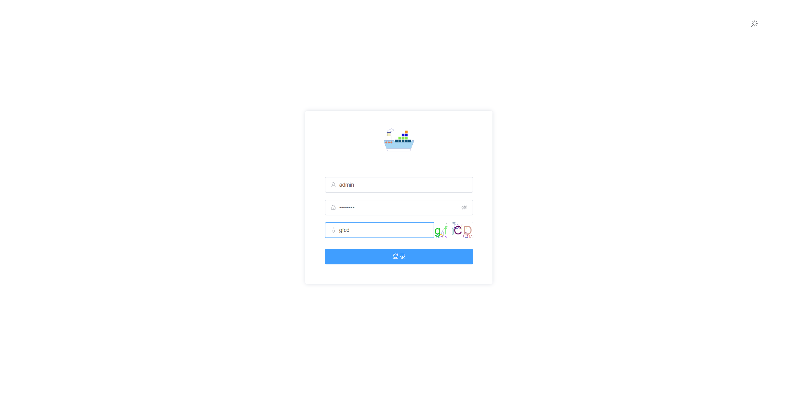

### 首页
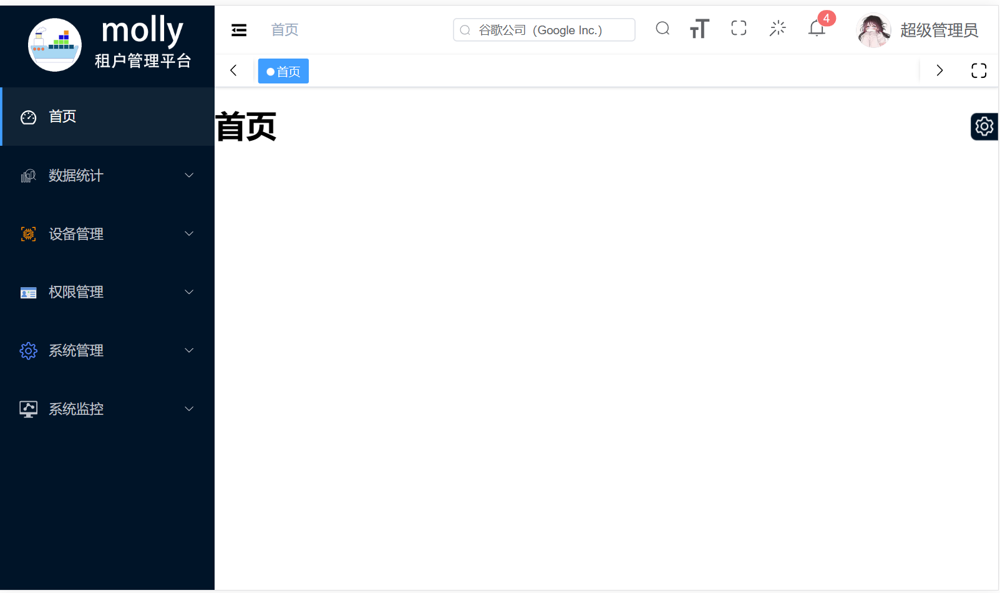

### 操作不同的租户
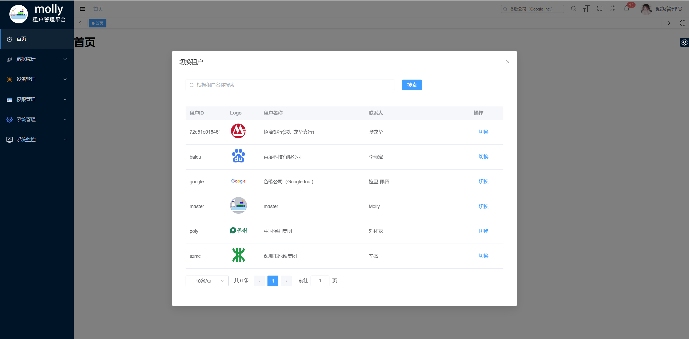

### 菜单搜索
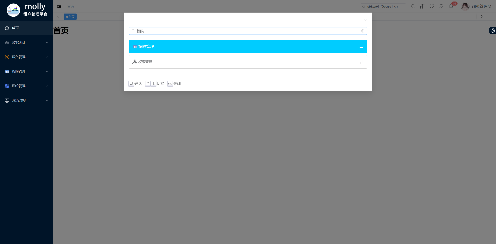

### 个人信息
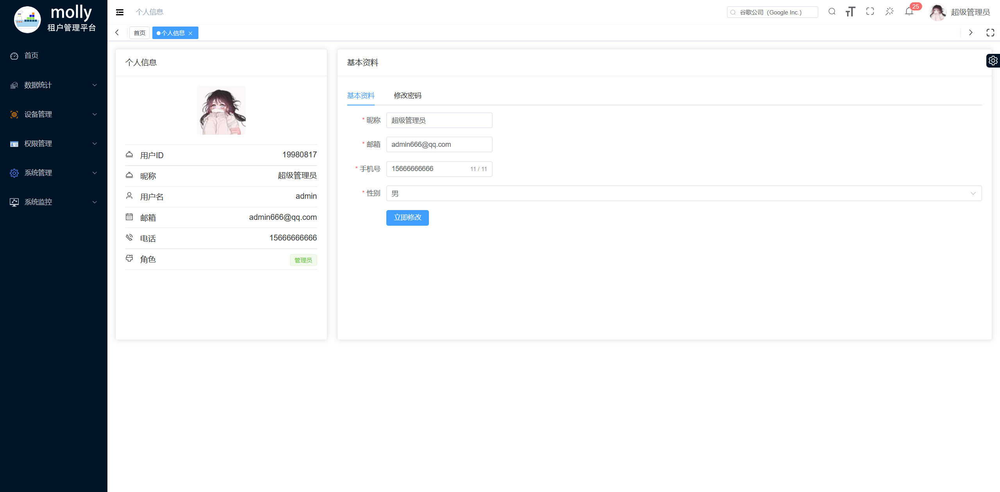

### 用户管理
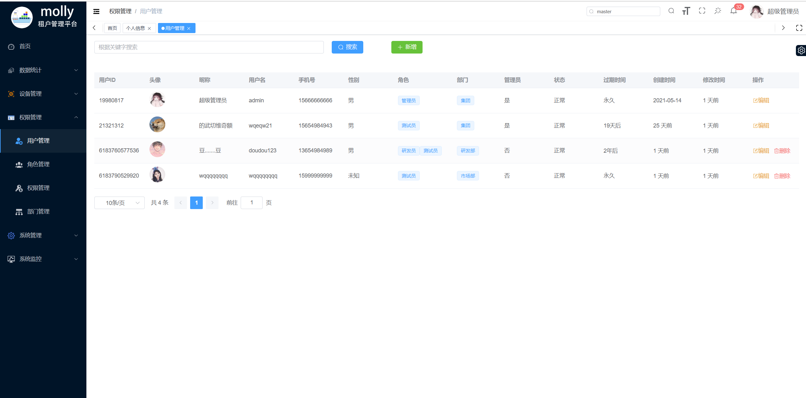

### 角色管理

### 权限管理
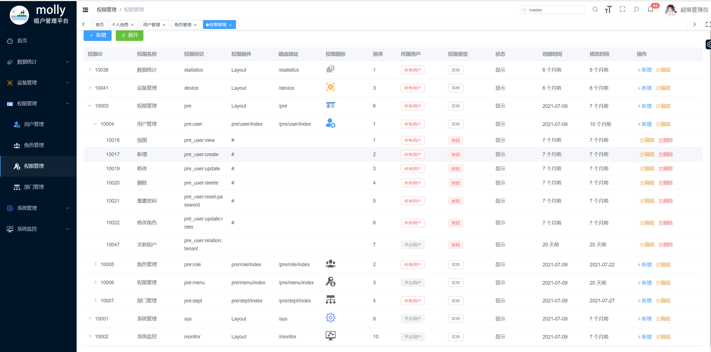

### 部门管理
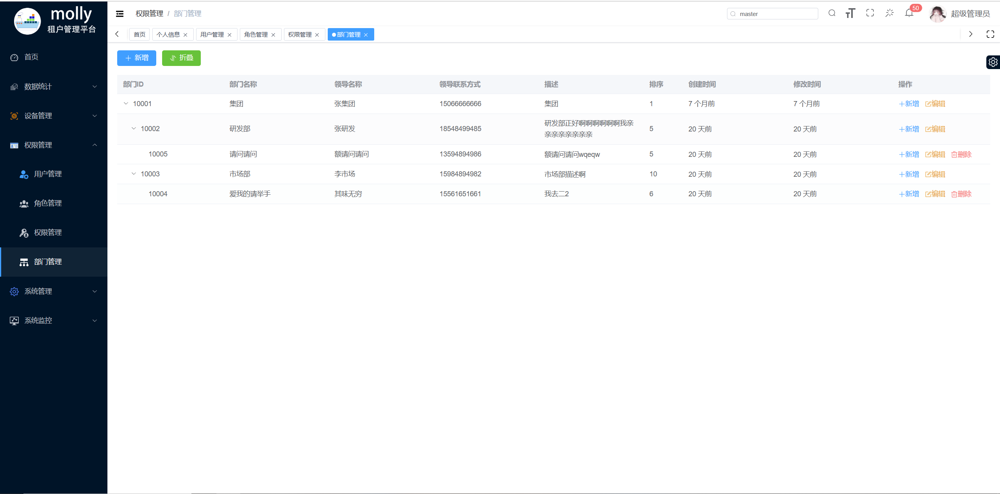

### 租户权限模板管理
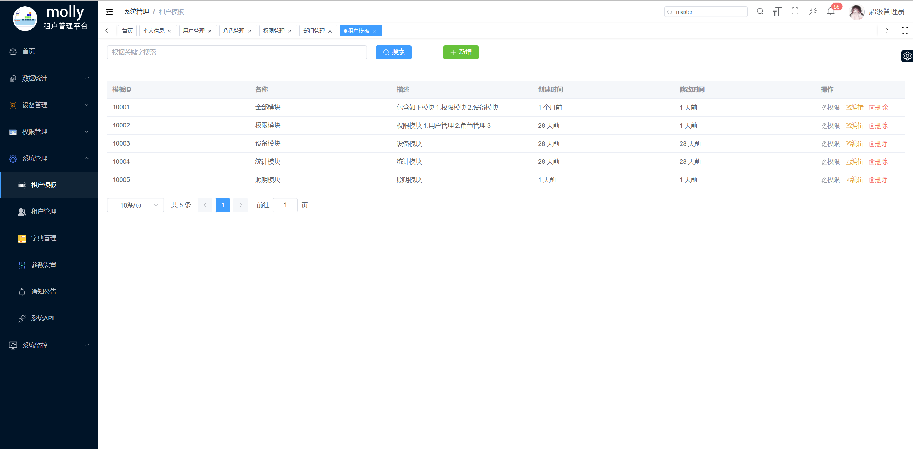

### 租户管理

### 租户新增
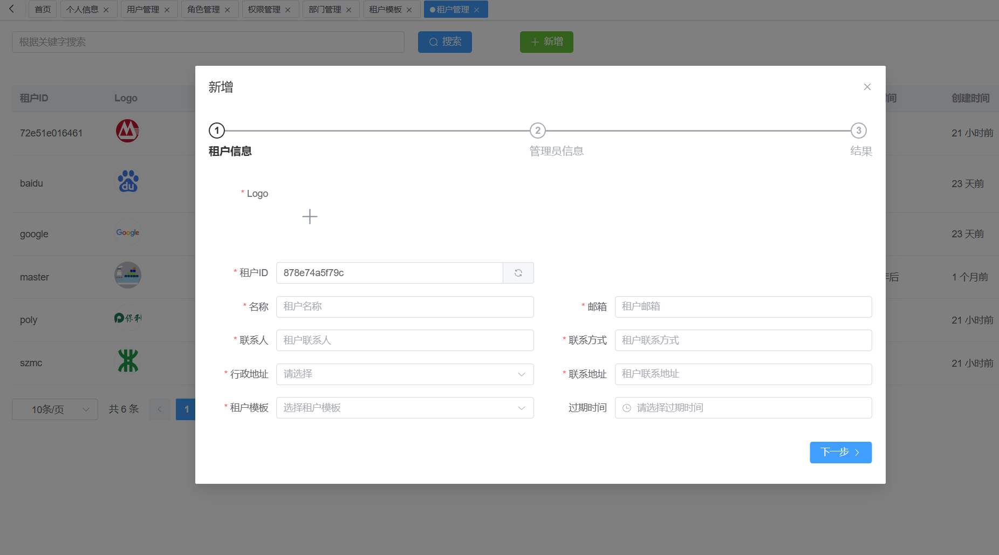

### 租户修改
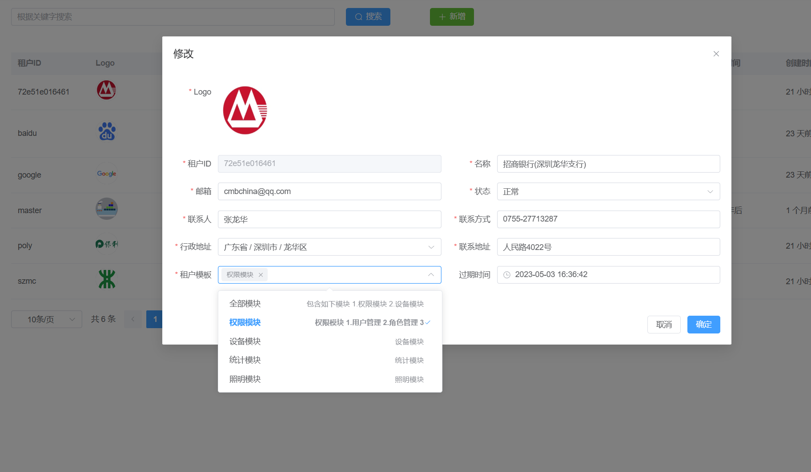

### 字典集合

### 系统运行详情
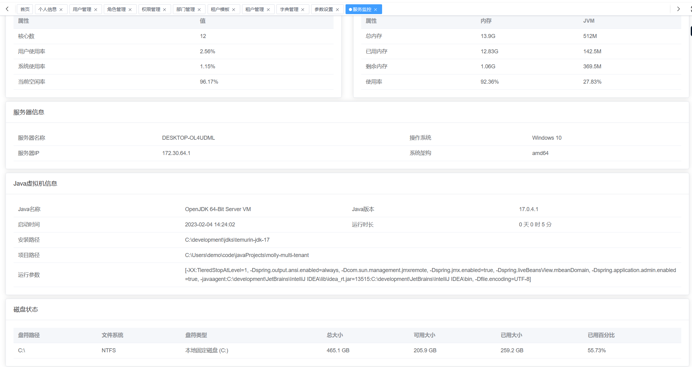

